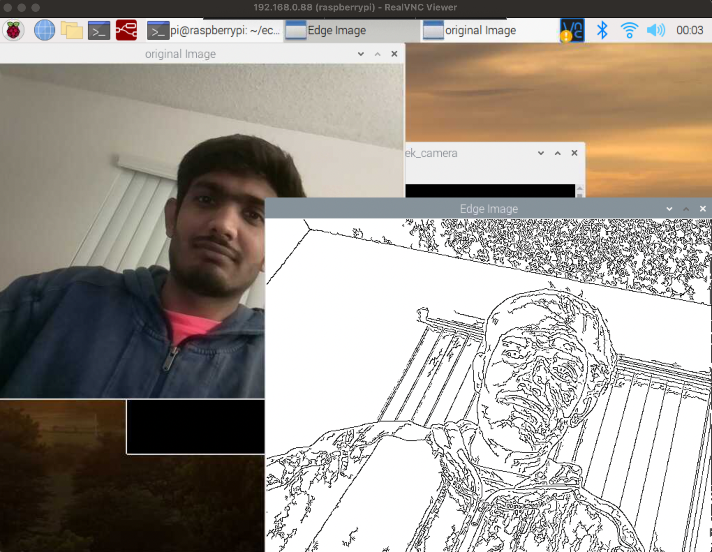
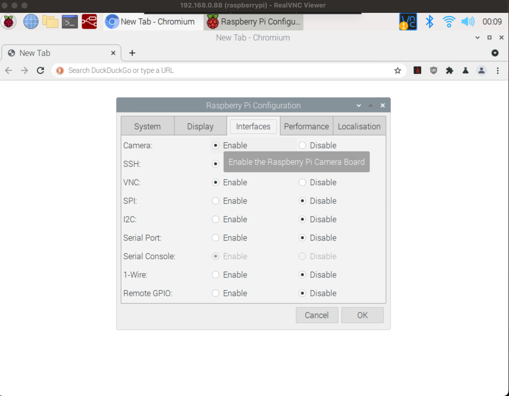

# raspi_canny_edge
 Live canny edge detection using raspberry pi camera (Raspberry Pi 4).
 OUTPUT IMAGE : 

# Requirements:
- Raspberry Pi Camera Module V2 (https://www.raspberrypi.org/products/camera/)
- OpenCV 

# installation steps :
sudo apt-get update

sudo apt-get install libopencv-dev

# Enable Raspberry PI camera : 

Enable the camera from raspi config and reboot raspi

# compilatioin setps

g++ vt_canny_edge_raspi.cpp -o vt_edge_live -std=c++11 -lopencv_core -lopencv_highgui -lopencv_imgproc -lopencv_videoio -lopencv_imgcodecs -Wall

# run steps 

./vt_edge_live

